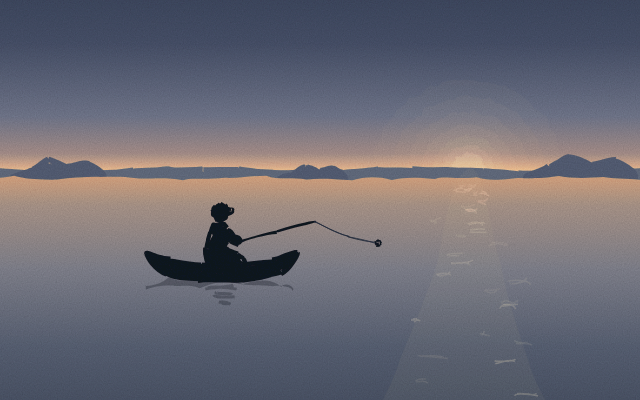
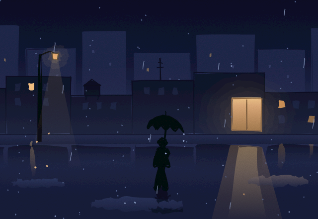
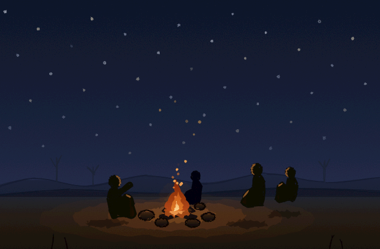
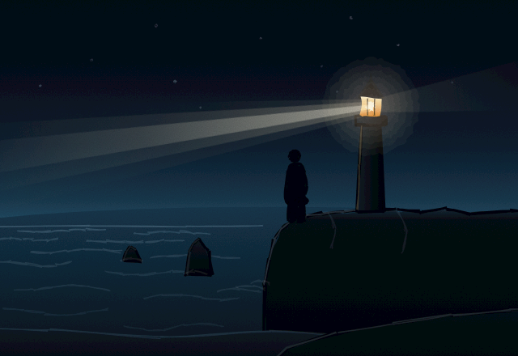
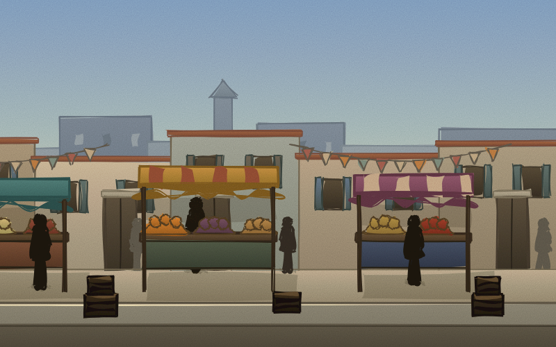
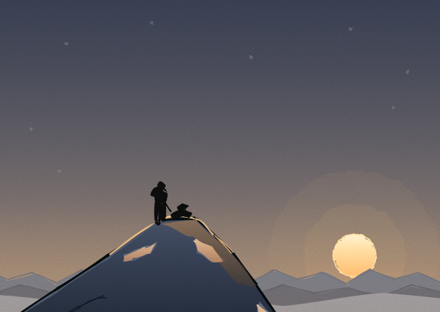

# sketchling

[](LICENSE)
[](https://www.npmjs.com/package/sketchling)

A hand drawn illustration and animation language for LLMs. Manim gave language models a way to express math visually in code. Sketchling does the same for expressive, hand drawn illustration and motion, in the register of Notion's and Anthropic's site illustrations.


```
npm install -g sketchling
npx playwright install chromium
```

That second line is a one time step. Rendering runs through a real headless Chromium browser (via Playwright), not a canvas library, so the first install pulls down a Chromium binary (a couple hundred MB). Video export also needs `ffmpeg` on your `PATH`; a still-only workflow does not.

## Why this exists

Ask an LLM to hand code an SVG path for a person or a tree and you get something crude. Two choices make hand drawn illustration tractable for a model instead:

1. **The vocabulary is expressive, not geometric.** There is no `Circle()` or `Arc()`. Primitives take character parameters like `weight`, `looseness`, and `energy`, not just coordinates. A loose stroke hides imprecision by design instead of exposing it.
2. **The renderer is forgiving by default.** Every shape draws through a [rough.js](https://roughjs.com) based sketchy engine: jittered strokes, imperfect closure, variable width. Slightly off geometry reads as style, not as a mistake, the same slack that lets a hand drawn line hide a shaky hand.

The result is meant to be driven by an LLM writing TypeScript, not a human hand authoring vector art.

## Quick start

```ts
import { sketch } from "sketchling";

const scene = sketch.scene({ width: 480, height: 420, background: "#7096c6" });

const lid = sketch.loop(
  [[70, 55], [330, 55], [330, 245], [70, 245]],
  { color: "#15130f", weight: "bold", looseness: 0.22, smooth: false }
);
scene.add(lid).drawOn({ at: 0, duration: 0.5 });

export default scene;
```

```
sketchling render scene.ts --out preview.png
sketchling render scene.ts --video preview.mp4 --fps 24
sketchling render scene.ts --serve
```

Working inside a clone of this repo instead of a published install? Import from `../src/index.js` in place of `"sketchling"`, or run `npm link` once you have built.

## What it can draw

Close to seventy example scenes live in [`examples/`](examples/), each one a real animation, not a static frame. A few, to give a sense of range:

| | | |
|---|---|---|
|  |  |  |
|  |  |  |
|  |  |  |

*The Lantern Maker*, a nine scene, three minute short film, is the longest single piece in the repo: an artisan crafts a paper lantern by lamplight, then carries it through a darkening town to release it from a bridge at night. Watch it at [`docs/story-lantern-maker.mp4`](docs/story-lantern-maker.mp4), source at [`examples/story/lantern-maker.ts`](examples/story/lantern-maker.ts).

Under the hood, every one of these is built from the same small set of primitives: strokes, loops, blobs, groups, and text, styled and timed, nothing more exotic than that.

## Core capabilities

**Hand drawn primitives.** `stroke`, `loop`, `blob`, `group`, `text`, plus small compositions like `arrow` and `speechBubble`. Style knobs (`weight`, `looseness`, `energy`, `fill`) control how imperfect and how expressive a shape reads, not just its geometry.

**Real animation, not just tweening.** `drawOn` reveals a shape the way a hand actually draws it, tracing the outline first and filling in after, with a pen tip riding the leading edge. Line boil keeps a finished stroke subtly alive rather than looking frozen the instant it lands.

**IK rigging and procedural gait.** `sketch.limb` gives you a two bone chain solved from a target position. `sketch.walk` turns two of those into a full bipedal gait, feet planting without sliding, arms counter swinging with the legs, generated from step count and stride length rather than hand tuned per pose.

**Camera and film.** Pan and zoom through a world bigger than one screen, follow a moving character, or cut several independent scenes together into one continuous piece with `sketch.film()`.

**Secondary motion.** `springTo` and `sketch.connector` give you damped spring lag and a bendable line that tracks a live target, the difference between an ear that snaps to a new angle and one that actually flops.

**Real shading.** `sketch.shade(baseColor, options)` derives a full highlight to shadow gradient from one color and a light direction, instead of hand picking two or three hex values per shape.

**Particles and sound.** A closed form particle emitter (sparks, snow, confetti, dust) with no simulation step, and `sketch.sound()` for scheduled notes and hits synthesized directly into the exported video's audio track.

**Five looks, three textures.** `"ink"`, `"flat"`, `"clay"`, `"lit3d"`, and `"toon3d"` change how geometry itself renders. `"watercolor"`, `"grain"`, and `"pixel"` are an independent whole frame texture layered on top of any of them.

The complete reference for all of this, including every gotcha found the hard way, lives in [AGENTS.md](AGENTS.md). It doubles as the direct prompt for coding agents working in this repo (also available as `.claude/skills/sketchling/` and `.agents/skills/sketchling/`), so it stays accurate rather than drifting from what the library actually does.

## How it works

A scene graph is built by running your `scene.ts` in plain Node, no DOM involved, which is cheap enough to lint before a single pixel exists. That serialized scene is then handed to a headless Chromium page, where rough.js draws it as SVG and GSAP drives the timeline. Renders are deterministic: the same scene at the same timestamp produces byte identical output, which makes `cmp` a real verification tool, not just an eyeball check.

## Status

Early and opinionated by design. Version 1 targets one aesthetic, flat hand drawn line illustration in the Notion and Anthropic register, rather than trying to be a general purpose illustration engine from day one. The bet is that a small, well designed vocabulary in one register beats a sprawling API that does everything adequately. Broader styles can follow once this one is genuinely good.

Not yet built: more shape helpers beyond `arrow` and `speechBubble` (a star, a checkmark), built the same way as thin compositions of existing primitives rather than a curated asset library, since that stays a deliberate non-goal; and a real skeleton extracted from an arbitrary drawn silhouette (`quickRig` currently derives proportions from a bounding box, which covers the common case well).

## Contributing

Issues and PRs are welcome. See [CONTRIBUTING.md](CONTRIBUTING.md) for setup, how to verify a change by actually rendering it, and what a good PR looks like. [CHANGELOG.md](CHANGELOG.md) tracks what shipped in each version.

## License

MIT. See [LICENSE](LICENSE).
