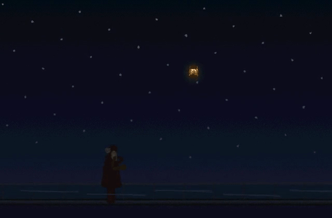
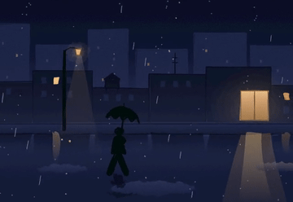
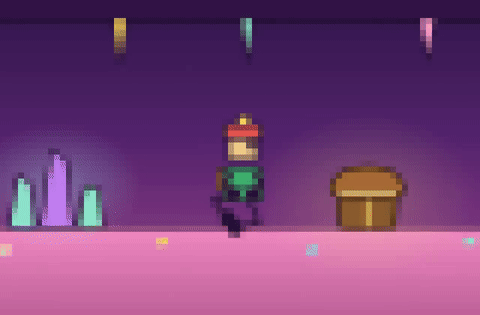
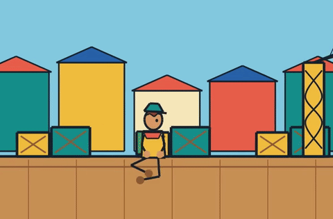
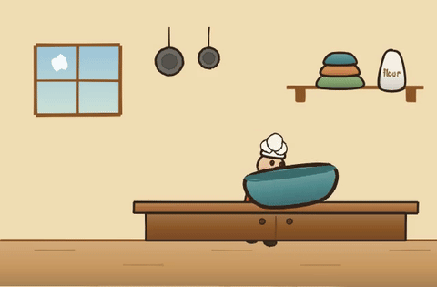

# sketchling

[](LICENSE)
[](https://www.npmjs.com/package/sketchling)

A hand drawn illustration and animation language for LLMs. Manim gave language models a way to express math visually in code. Sketchling does the same for expressive, hand drawn illustration and motion — not a diagramming DSL, not a general 3D engine, a vocabulary for drawing and moving things by hand.



This is the closing shot of *The Lantern Maker*, a nine scene, three minute short film. An artisan crafts a paper lantern by lamplight, then carries it through a darkening town to release it from a bridge at night. Watch the full thing at [`docs/story-lantern-maker.mp4`](docs/story-lantern-maker.mp4).

Nobody hand animated this. [Devin](https://devin.ai) built it cold, working from nothing but this repository's own docs, the same way every example in [`examples/`](examples/) was built: an LLM writing TypeScript against a vocabulary, not a human hand authoring vector art. That is the actual point of sketchling. If a coding agent can read a README and come out the other side with a real hand drawn film, the vocabulary is doing its job.

A few more scenes from the same batch, also built cold, also unedited:

<table>
<tr>
<td></td>
<td></td>
</tr>
</table>

More stills from the same set: [lighthouse watch](docs/showcase-lighthouse-watch.png), [campfire story](docs/showcase-campfire-story.png), [market street](docs/showcase-market-street.png), [summit sunrise](docs/showcase-summit-sunrise.png), [snow village](docs/showcase-snow-village.png), [moonlit sail](docs/showcase-moonlit-sail.png). Full videos for all of these live in [`docs/`](docs/), source in [`examples/showcase/`](examples/showcase/).

Everything above shares one register — hand-drawn ink, restrained and muted — because it's one batch, not a ceiling. Same library, same primitives, different `look`/`texture`, three more coding agents building cold on three unrelated subjects:

<table>
<tr>
<td><br><sub><code>texture: "pixel"</code> — <a href="examples/story/candy-cave.ts">candy-cave.ts</a></sub></td>
<td><br><sub><code>look: "flat"</code> — <a href="examples/story/harbor-explorer.ts">harbor-explorer.ts</a></sub></td>
</tr>
<tr>
<td><br><sub><code>look: "clay"</code> — <a href="examples/story/clay-baker.ts">clay-baker.ts</a></sub></td>
<td>Also real: a toon-shaded 3D toy robot (<a href="examples/showcase/nursery-blocks.ts">nursery-blocks.ts</a>, <code>look: "toon3d"</code>) and a film-grain jazz club with a synthesized score (<a href="examples/story/late-set.ts">late-set.ts</a>, <code>texture: "grain"</code>).</td>
</tr>
</table>

## Playground

[**anaygarodia.github.io/sketchling**](https://anaygarodia.github.io/sketchling/) runs the whole
vocabulary in a browser tab: write a scene, watch it draw itself, scrub the timeline, share a
render as a link. It is the same renderer the CLI drives, not a cut down demo — source and notes
in [`site/`](site/).

## Install

```
npm install -g sketchling
npx playwright install chromium
```

The second line is a one time step. Rendering runs through a real headless Chromium browser (via Playwright), not a canvas library, so the first install pulls down a Chromium binary, a couple hundred MB. Video export also needs `ffmpeg` on your `PATH`. A still only workflow does not.

## Quick start

```ts
import { sketch } from "sketchling";

const scene = sketch.scene({ width: 480, height: 420, background: "#7096c6" });

const lid = sketch.loop(
  [[70, 55], [330, 55], [330, 245], [70, 245]],
  { color: "#15130f", weight: "bold", looseness: 0.22, smooth: false }
);
scene.add(lid).drawOn({ at: 0, duration: 0.5 });

export default scene;
```

```
sketchling render scene.ts --out preview.png
sketchling render scene.ts --video preview.mp4 --fps 24
sketchling render scene.ts --serve
```

Working inside a clone of this repo instead of a published install? Import from `../src/index.js` in place of `"sketchling"`, or run `npm link` once you have built.

## For coding agents

Every film in this README, including *The Lantern Maker* at the top, was built by handing an agent a prompt like this and nothing else:

```
Using the sketchling npm package, build a short hand-drawn animated film about
[subject]. Read AGENTS.md in the package for the full API. Pick a look/texture
on purpose instead of defaulting to look: "ink". Render it, run
`sketchling validate`, and fix anything it flags before calling it done.
```

[AGENTS.md](AGENTS.md) is the actual reference — every primitive, every animation, every gotcha found the hard way, written for an agent to read cold and act on, not summarized marketing copy. It's also installed as `.claude/skills/sketchling/` and `.agents/skills/sketchling/` so it loads automatically in repos that use those conventions.

## Why this exists

Ask an LLM to hand code an SVG path for a person or a tree and you get something crude. Two choices make hand drawn illustration tractable for a model instead:

1. **The vocabulary is expressive, not geometric.** There is no `Circle()` or `Arc()`. Primitives take character parameters like `weight`, `looseness`, and `energy`, not just coordinates. A loose stroke hides imprecision by design instead of exposing it.
2. **The renderer is forgiving by default.** Every shape draws through a [rough.js](https://roughjs.com) based sketchy engine: jittered strokes, imperfect closure, variable width. Slightly off geometry reads as style, not as a mistake, the same slack that lets a hand drawn line hide a shaky hand.

## Core capabilities

**Hand drawn primitives.** `stroke`, `loop`, `blob`, `group`, `text`, plus small compositions like `arrow` and `speechBubble`. Style knobs (`weight`, `looseness`, `energy`, `fill`) control how imperfect and how expressive a shape reads, not just its geometry.

**Real animation, not just tweening.** `drawOn` reveals a shape the way a hand actually draws it, tracing the outline first and filling in after, with a pen tip riding the leading edge. Line boil keeps a finished stroke subtly alive rather than looking frozen the instant it lands.

**Labeled, relative scheduling.** Every animation lives on one timeline, but you don't have to hand-compute absolute seconds for it: `scene.label("liftoff", 4.2)` names a moment, and any later `at` can reference it (`"liftoff+0.4"`), with `node.endAt` chaining a sequence off whatever just finished — instead of a wall of hand-tallied literals.

**IK rigging and procedural gait.** `sketch.limb` gives you a two bone chain solved from a target position. `sketch.walk` turns two of those into a full bipedal gait, feet planting without sliding, arms counter swinging with the legs, generated from step count and stride length rather than hand tuned per pose.

**Camera and film.** Pan and zoom through a world bigger than one screen, follow a moving character, or cut several independent scenes together into one continuous piece with `sketch.film()`, the tool *The Lantern Maker* itself is built with.

**Secondary motion.** `springTo` and `sketch.connector` give you damped spring lag and a bendable line that tracks a live target, the difference between an ear that snaps to a new angle and one that actually flops.

**Real shading.** `sketch.shade(baseColor, options)` derives a full highlight to shadow gradient from one color and a light direction, instead of hand picking two or three hex values per shape.

**Particles and sound.** A closed form particle emitter (sparks, snow, confetti, dust) with no simulation step, and `sketch.sound()` for scheduled notes and hits synthesized directly into the exported video's audio track.

**Five looks, three textures.** `"ink"`, `"flat"`, `"clay"`, `"lit3d"`, and `"toon3d"` change how geometry itself renders. `"watercolor"`, `"grain"`, and `"pixel"` are an independent whole frame texture layered on top of any of them.

The complete reference for all of this, including every gotcha found the hard way, lives in [AGENTS.md](AGENTS.md) — see "For coding agents" above.

## How it works

A scene graph is built by running your `scene.ts` in plain Node, no DOM involved, which is cheap enough to lint before a single pixel exists. That serialized scene is then handed to a headless Chromium page, where rough.js draws it as SVG and GSAP drives the timeline. Renders are deterministic: the same scene at the same timestamp produces byte identical output, which makes `cmp` a real verification tool, not just an eyeball check.

## Status

Early and opinionated by design. The bet is a small, well designed vocabulary — primitives with character, not a `Circle()`/`Arc()` geometry API — beats a sprawling one that does everything adequately. Five looks and three textures exist today (`"ink"`, `"flat"`, `"clay"`, `"lit3d"`, `"toon3d"`, `"watercolor"`, `"grain"`, `"pixel"`), because "opinionated" means a small deliberate vocabulary, not one fixed aesthetic — the gallery above is five of them on five unrelated subjects, not one register wearing different clothes.

## Contributing

Issues and PRs are welcome. See [CONTRIBUTING.md](CONTRIBUTING.md) for setup, how to verify a change by actually rendering it, and what a good PR looks like. [CHANGELOG.md](CHANGELOG.md) tracks what shipped in each version.

## License

MIT. See [LICENSE](LICENSE).
