# sketchling

[](LICENSE)

A hand-drawn illustration and animation language for LLMs. Manim gave language models a way to express math visually in code; sketchling does the same for expressive, hand-drawn illustration and motion, in the register of Notion's and Anthropic's site illustrations.


```
npm install -g sketchling
npx playwright install chromium   # one-time: rendering runs through a real headless browser
```

Renders go through actual headless Chromium (via [Playwright](https://playwright.dev)), not a
canvas library — that install step above is a one-time ~150-300MB Chromium download, not
something `npm install` pulls in silently. `--video` export (and the `"pixel"` texture) also
needs `ffmpeg` on `PATH` — install it however your platform normally does (`brew install
ffmpeg`, `apt install ffmpeg`, ...); a still-only workflow (`--out preview.png`) doesn't need it.

## Why

LLMs write code fluently but draw badly — ask one to hand-code an SVG path for a human figure and you get something crude. Two design choices make this tractable anyway:

1. **The vocabulary is expressive, not geometric.** No `Circle()`, no `Arc()`. Primitives take character parameters — `weight`, `looseness`, `energy` — not just coordinates. A "loose" stroke hides imprecision by design instead of exposing it.
2. **The renderer is forgiving by default.** Every shape draws through a [rough.js](https://roughjs.com)-based sketchy engine (jittered strokes, imperfect closure, variable width). Slightly-off geometry reads as *style*, not as a mistake — the same slack that makes a hand-drawn line hide a shaky hand.

The result is meant to be driven by an LLM writing TypeScript, not a human hand-authoring vector art.

## Quick example

```ts
import { sketch } from "sketchling";

const scene = sketch.scene({ width: 480, height: 420, background: "#7096c6" });

const lid = sketch.loop(
  [[70, 55], [330, 55], [330, 245], [70, 245]],
  { color: "#15130f", weight: "bold", looseness: 0.22, smooth: false }
);
scene.add(lid).drawOn({ at: 0, duration: 0.5 });

export default scene;
```

```
sketchling render scene.ts --out preview.png
```

If you're working inside a clone of this repo rather than a published install, `examples/*.ts` import from `../src/index.js` instead of `"sketchling"` — same API, just a relative path to the unbuilt source until you `npm link` or install the published package.

## Gallery

Thirteen scenes, different corners of the vocabulary — source for all of them is in `examples/`, and each one renders as an animation (`--video`), not just a still. Nothing in these scenes goes still the instant it's drawn.

| | | |
|---|---|---|
|  | 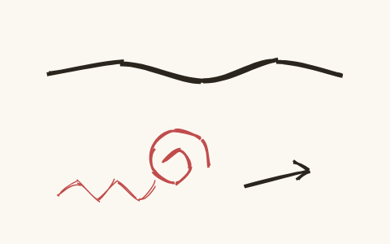 | 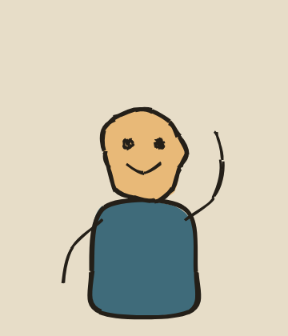 |
| 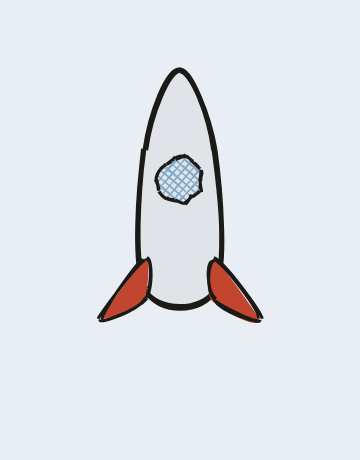 | 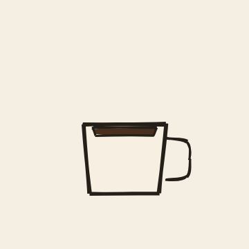 | 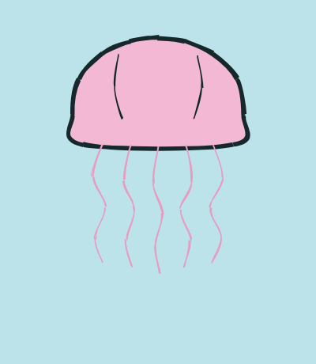 |
| 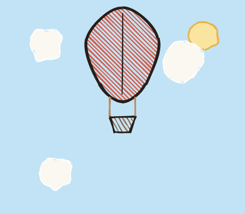 |  | 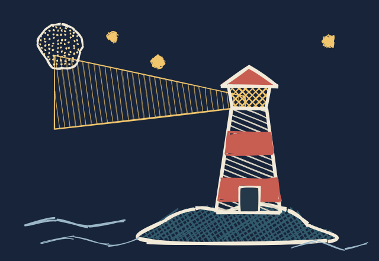 |
| 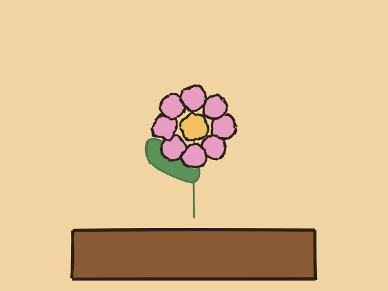 | 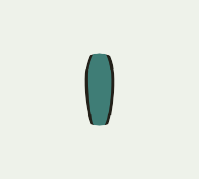 | 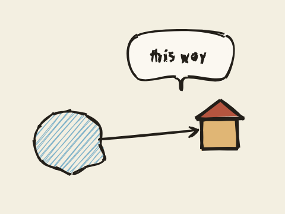 |

Boxy geometry with solid fills, hachure and cross-hatch texture, pure open-stroke linework with no fills at all, an organic blob-built character that waves once it's drawn, a rocket that launches off the top of the frame leaving its exhaust behind, rising coffee steam that drifts and fades after it draws, a jellyfish with independently-waving tentacles and a slow breathing pulse, a hot-air balloon drifting through clouds, a signpost with a hand-lettered caption, a night lighthouse sweeping its beam, and a three-scene `sketch.film()` sequence cutting from seed to bloom.

Several of these weren't written by us. `jellyfish-drift.ts` was written by a fresh Claude agent given nothing but this README and six of the other example files: no renderer internals, no conversation history, no hints. It built and rendered on the first attempt, no fixes needed. [`examples/story/`](examples/story/) is a larger version of the same test — a six-scene short, *Pip and the Sapling*, with a real beginning, middle, and end and one character drawn consistently across every scene ([`docs/pip-and-the-sapling.mp4`](docs/pip-and-the-sapling.mp4)). `lantern-maker.ts` in the same directory is a longer one built by [Devin](https://devin.ai) cold off this README and AGENTS.md: a nine-scene, 2:57 short film — an artisan crafting a paper lantern by lamplight, then carrying it out through a darkening town to release it from a bridge — reusing the same character and lantern across every scene, with real light-direction shading throughout (the workshop lamp-lit, the outdoor scenes cooling into night with the lantern itself as the one warm light source). Built specifically to answer two complaints about the library's own output: that hand/gesture motion read as rigid (the close-up craft-work scenes lean on `springTo`/`sketch.connector` and varied GSAP eases rather than one fixed ease for every motion) and that the videos felt basic (a real multi-beat narrative arc, not one mood held for a few seconds). Surfaced three real renderer behaviors along the way, worked around and documented in the file rather than patched at the source (this scene was built under the same "don't touch `src/`" constraint as every other cold-agent test in this README): `drawOn`'s reveal mask leaves permanent gaps in filled shapes taller than ~160px; two time-overlapping `moveBy` calls fight over `x` since `moveBy` always tweens both axes at once (silently cut a walk to a tenth of its intended distance before it was caught); and `springTo` overwrites a node's own translate, so anything meant to spring can't also be placed with `initial({x, y})` ([`docs/story-lantern-maker.mp4`](docs/story-lantern-maker.mp4)).

The rest of the gallery is the same test run against different agents entirely: `hot-air-balloon.ts`, `signpost-hello.ts`, and `film-seed-to-bloom.ts` were each written cold by [Devin](https://devin.ai), and `moonlit-lighthouse.ts` by [Codex](https://openai.com/codex/). Same rules every time — README and `examples/` only, no implementation source, no hints. Between them they found two real bugs before this launch shipped: `moveTo()` silently behaving like a relative move instead of an absolute one, and `sketch.text()` silently misplacing every letter past the first few characters of a string. Both are fixed now (see `AGENTS.md`'s "Working on the library" section and the commit history if you want the detail) — this is the actual value of testing against agents that don't share any context with the one that built the tool.

### Rig and look gallery

Twenty more scenes in [`examples/gallery/`](examples/gallery/), proving out IK rigging, the procedural walk generator and auto-rig, secondary-motion springs and connectors, particles, audio, gradient shading, and every `look`/`texture` combination — each one still an animation (`docs/gallery-*.mp4`), not just a still.

| | | |
|---|---|---|
| 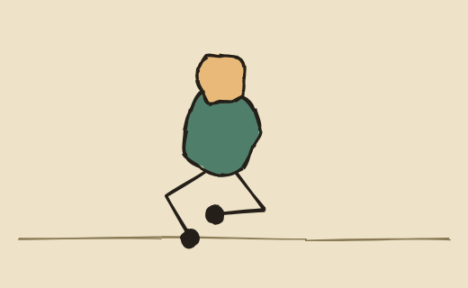 | 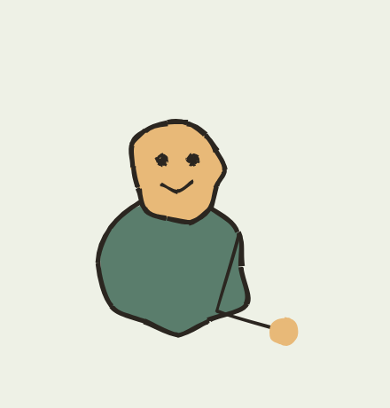 | 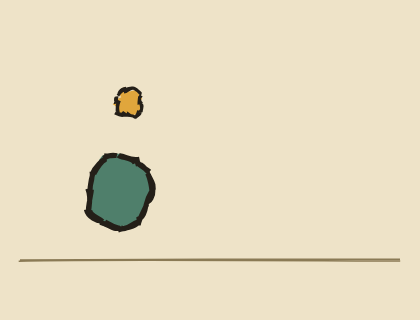 |
| 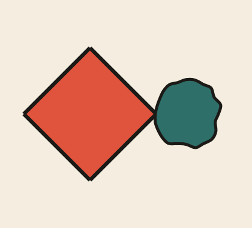 | 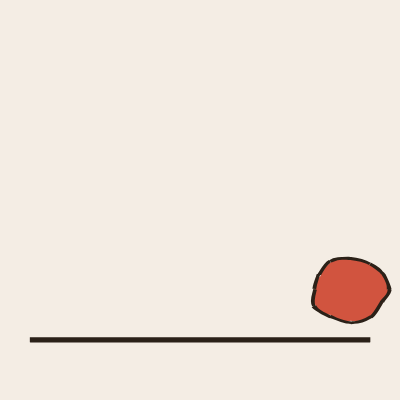 | 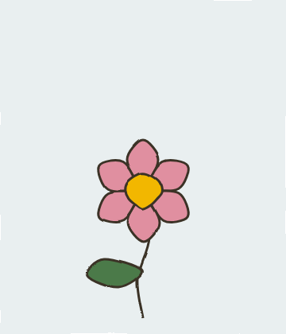 |
| 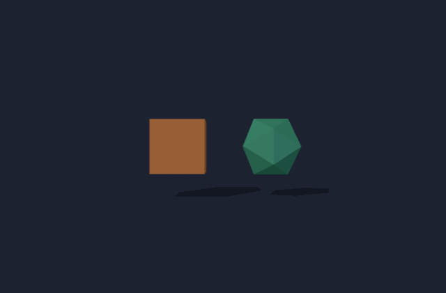 | 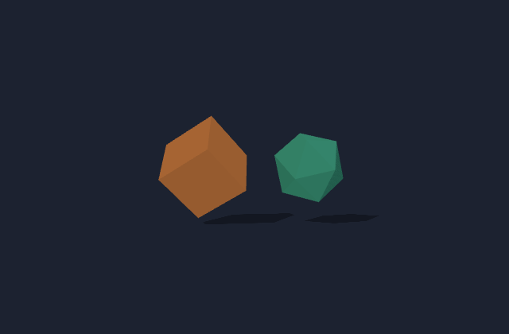 | 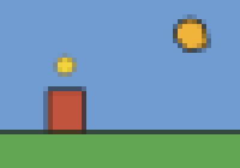 |
| 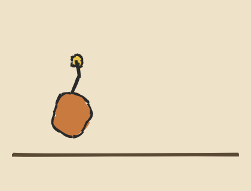 | 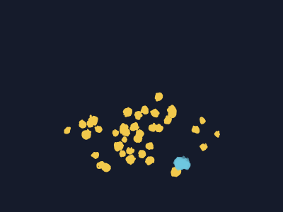 | 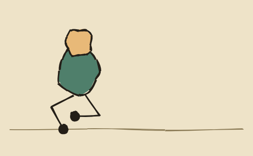 |
| 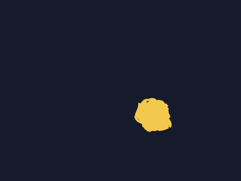 | 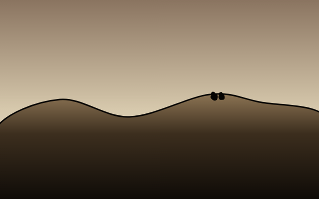 | 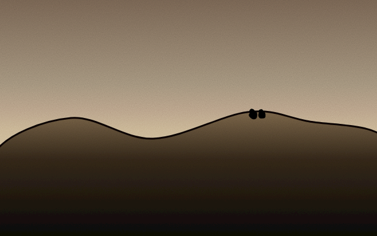 |
| 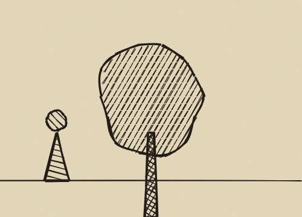 | 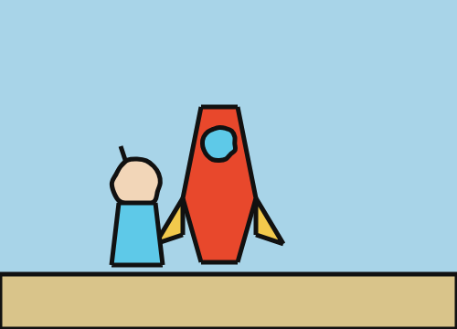 | 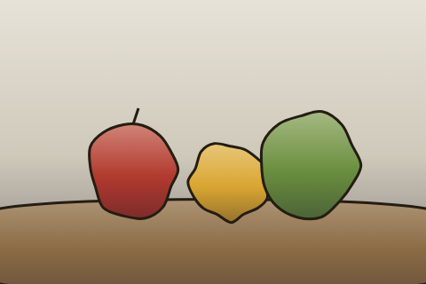 |
| 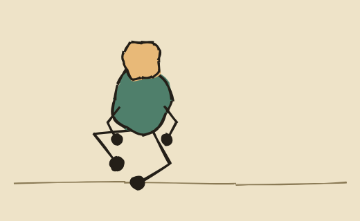 | 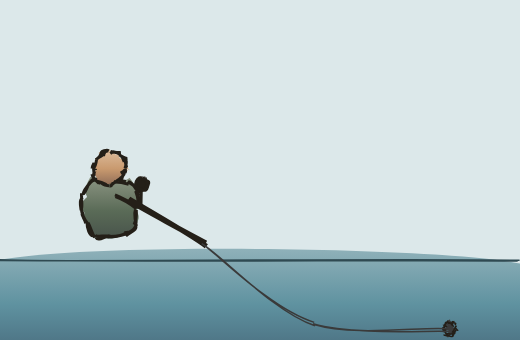 | |

`walk-cycle.ts`: a two-legged character strides across the ground on `sketch.limb` legs driven by `sketch.walk` — the planted foot holds still (verified to a fraction of a pixel) while the other swings through. `reaching-arm.ts`: a single IK arm reaches toward three different targets in sequence, the elbow solving itself each time. `spring-follow.ts`: a bead trailing a bouncing body via `springTo`, lagging and overshooting across three bounces rather than tracking it 1:1. `flat-look.ts`, `clay-look.ts`, `lit3d-mesh.ts`, `toon-look.ts`: one small scene per non-default `look`, each picked to show off that look's own distinguishing trait — crisp precision, stop-motion stepping, real lighting and shadows, and cel-shaded bands, respectively. `toon-look.ts` is deliberately the same box-and-icosahedron scene as `lit3d-mesh.ts` (same geometry, same spin, one line changed) so the two sit side by side as a direct comparison. `watercolor-look.ts`, `pixel-look.ts`: one small scene per `texture` — edge bleed and blocky low-res cells, respectively — both layered over `look: "flat"` here, though either texture combines with any of `"ink"`/`"flat"`/`"clay"` just as well; `look` and `texture` are independent axes (see the Look/texture reference further down). `bendy-antenna.ts`: `springTo` and `sketch.connector` paired for real — a bouncing body's own spring-driven accessory, attached to a fixed point on the body by a redrawn, bending stroke, not just trailing loose. `particle-burst.ts`: two independently-seeded firework bursts, each particle's whole trajectory a closed-form ballistic formula rather than a stepped simulation. `quickrig-walk.ts`: `walk-cycle.ts`'s exact character, with `sketch.quickRig` deriving hip placement and leg length from the body's own bounding box instead of five hand-picked constants. `sound-motif.ts`: a four-note piano motif over a sustained pad chord, `sketch.sound()`'s only gallery demo — a dot pulses on each note (`scaleTo`, same `at` values) so the video shows the audio and the visual landing on the same beats. `gradient-shading.ts`: a gradient `fill.color` on one landform instead of a flat fill — real per-shape volumetric shading (lit from above, falling into shadow) rather than a uniform color, with two riders kept deliberately tiny so the landform carries the frame. `grain-look.ts`: the exact same scene as `gradient-shading.ts`, only `texture: "grain"` added — fine aged-paper/film-grain texture layered over the same gradient-shaded geometry, look and texture composing rather than competing. `old-book-look.ts`: the motivating case for splitting look/texture into two axes at all — default `look: "ink"` (sketchy jitter) plus real hachure/cross-hatch shading (the actual engraving technique, on a tree and a small walking figure) plus `texture: "grain"`, three things that couldn't combine before the split, all doing real work in one small scene. `ligne-claire-look.ts`: proof that a Tintin-style clean-line-comic register needs no new capability at all — `look: "flat"` + `weight: "bold"` + `fill.style: "solid"` + `looseness: 0` on every blob (a window, a head), all existing knobs, no new code. `shade-helper.ts`: `sketch.shade(base, {from, amount})`, a real light-direction gradient derived from one base color instead of hand-picking 2-3 hex stops per shape — every gradient-shaded example before this one (including `gradient-shading.ts` above) authored its own lighter/darker stops by eye. Three fruits on a table, all lit `from: "top"`, sharing the same light logic automatically instead of each needing hand-tuned stops that happen to agree with their neighbors; the shadow side is nudged cool/blue-violet and the lit side warm, not a flat lighter/darker lerp, the same atmospheric-perspective instinct `nightfall-hill.ts` and `quiet-crossing.ts` already use by hand. `walk-cycle-arms.ts`: `walk-cycle.ts`'s exact character, with `sketch.walk`'s new `arms` option added — a real phase-locked contralateral counter-swing (right leg forward, left arm forward) instead of arms doing nothing while the legs walk, the gap every hand-built walk cycle up to this point either left alone or hit a detachment bug trying to animate separately. `fishing-cast.ts`: `springTo` + `sketch.connector` (the same pairing `bendy-antenna.ts` proves out) applied to a held prop instead of a body accessory — a fishing rod that loads back then whips forward on a snap-and-overshoot `"back.out"` ease rather than `"sine.inOut"`, a lure that springs out toward its landing point with real damped lag instead of arriving and stopping dead, and a line that bows naturally between a fixed rod-tip anchor and the lure's own live position. The direct answer to "hand-held prop motion reads as rigid" — every rotateTo/moveTo in this gallery before this scene used a fixed ease with no follow-through.

Six of the first nine were each written by their own agent off `AGENTS.md` alone, with a hard rule to touch nothing else in the repo — not the cross-vendor, no-shared-context test the jellyfish/balloon/lighthouse scenes above are (those were independent tools with zero relationship to the one that built the library; these six were spawned by this same project's own session). Each did its own build, render, and self-check before reporting done. What's verified independently, after the fact, by a separate pass with no stake in the outcome: `walk-cycle.ts`'s planted foot re-checked with pixel-tracking (holds to within 0.06px across the whole grounded phase), `watercolor-look.ts`'s bleed re-checked with a pixel diff against the same scene forced to `"flat"` (7,003px changed, nowhere near the ~100px noise floor), `toon-look.ts`'s banding re-checked with a pixel diff against the identical scene forced to `"lit3d"` (nearly 15,000px changed, well above noise — though genuinely subtler than cel-shading on smooth geometry would look, since every `mesh3d` face here is already flat-shaded), and a full lint sweep across all nine with no unexpected findings. `pixel-look.ts`, `spring-follow.ts`, `toon-look.ts`, `bendy-antenna.ts`, `particle-burst.ts`, `quickrig-walk.ts`, `sound-motif.ts`, and `gradient-shading.ts` are the exceptions to the cold-agent process — written directly, alongside their respective features. `spring-follow.ts` in particular went through two real, independently-caught bugs before it was right: an initial settle-time estimate anchored to the wrong reference point left the bead frozen mid-oscillation about 14px off target (caught by pixel-tracking its resting position against the driver's known final position, not by eye), and an early version connecting the bead to the body with a static drawn stalk read as visibly broken — the bead sprang away from the motionless rod rather than bending it, so the stalk was dropped in favor of a plain trailing accessory (documented above as a real limitation, not silently designed around). `particle-burst.ts` caught its own real bug: an initial version had no timeline-duration reservation, so a `--video` export of a particles-only scene rendered exactly one frame at 0.00s before the fix. `quickrig-walk.ts`'s foot-plant was re-checked with the same pixel-tracking method as `walk-cycle.ts`'s, and against `walk-cycle.ts`'s own baseline directly (not just eyeballed): both show the same-magnitude ~2px apparent drift under this tracking method, confirming it's a limitation of the tracking (component merging near the knee, in the mask band used), not a regression specific to `quickRig`.

### Showcase

Nine longer scenes in [`examples/showcase/`](examples/showcase/), composing the capabilities above together rather than demonstrating one at a time.

| | |
|---|---|
| 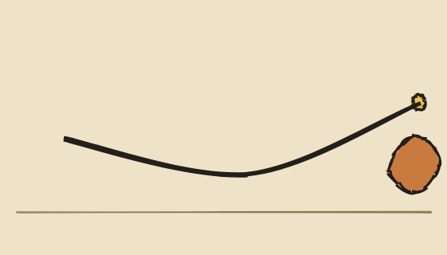 | 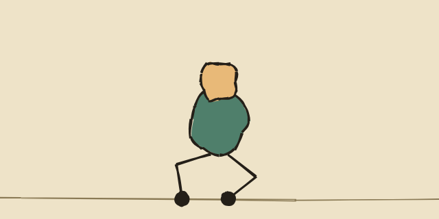 |
| 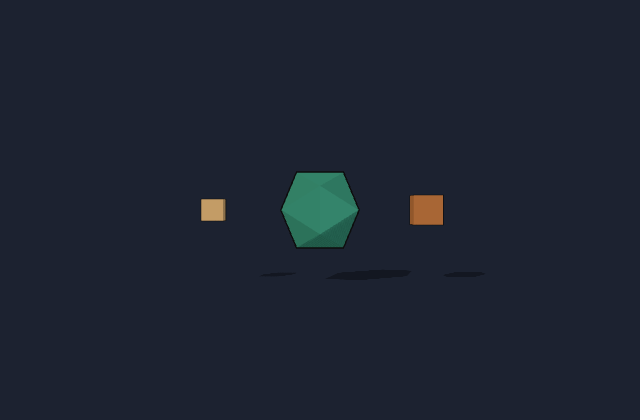 | 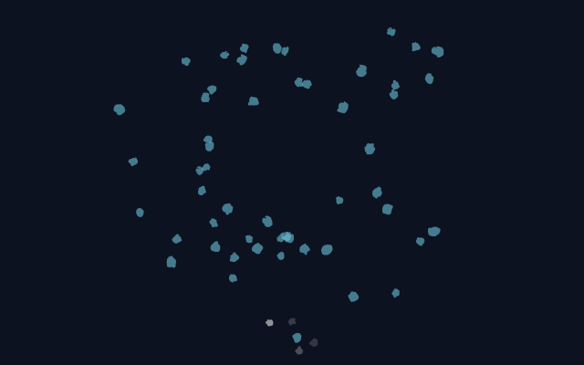 |
|  | 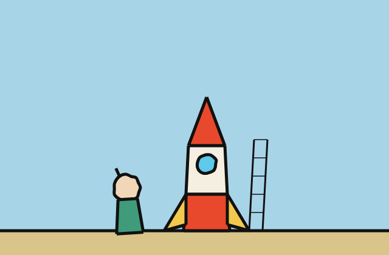 |
| 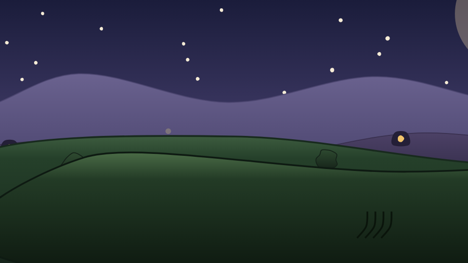 | 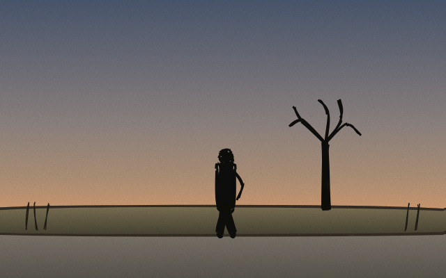 |
| 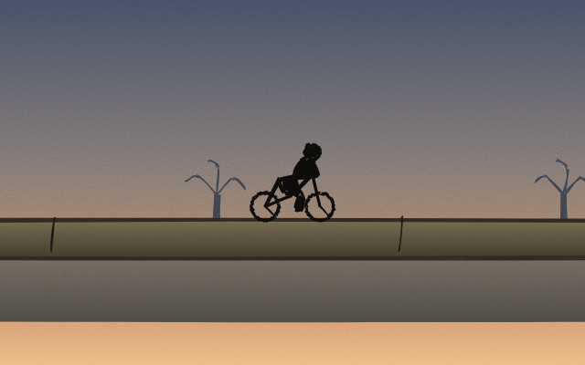 | |

`critter-hop.ts`: `springTo` + `sketch.connector` + `sketch.particles` in one scene — a hopping critter's own body drives a bendy spring-antenna, kicking up a puff of dust on every landing. The dust's spawn points are computed directly from the same hop deltas driving the body, not read live off it — `springTo`/`connector` only ever track a node's own local offset, never an ancestor group's, so pairing them with a `sketch.walk`-driven character (whose motion comes from the group, not the body node itself) doesn't work; this scene deliberately avoids that combination rather than fighting it (see `AGENTS.md`'s Secondary motion section). `quickrig-parade.ts`: a `sketch.quickRig` walker crossing a `scene.camera().follow()`-tracked world four times wider than the viewport, with a small dust puff computed at each footfall from `sketch.walk`'s own step math (hip position plus accumulated stride, at the exact instant each leading leg's landing tween completes) — the same precompute-instead-of-track approach as the dust in `critter-hop.ts`, and how this scene sidesteps the same group-tracking limitation for its footfalls. Also the scene that surfaced a real `camera.follow` gotcha: `.follow` only holds its tracked framing for its own `[at, at+duration]` window, so a follow window that stops exactly when the walk does snaps back to the scene's initial framing during the settle tail its own dust puffs add — fixed by padding the window past the walk's end (documented in `AGENTS.md`'s Camera section now, not just fixed quietly here). `toon-tumble.ts`: a `"toon3d"` scene built as a real composition rather than one spinning shape — a hero icosahedron drops in with a cartoon squash-and-stretch landing (`squashTo`, flattened on impact, elastic-eased back to round), then two boxes orbit it on a hand-keyframed circular path (`renderer3d.ts` doesn't implement `moveAlong`, only `moveTo`/`moveBy`/`scaleTo`/`squashTo`/`rotateTo`/`fadeTo`/`spin3d` — so the orbit is eight `moveTo` waypoints, not one call). `fireworks-finale.ts`: `sketch.particles` alone, six independent emitters — three solo bursts building up, then five firing at once for the finale — costing the renderer nothing extra to seek into concurrently versus any one of them alone, since none of it is a live simulation. `rocket-launch-clean-line.ts`: a small clean-line/ligne-claire story beat, not just a static tableau — a character walks up to an original banded rocket on a launch pad, ignition (particles), then liftoff with `camera.follow()` tracking the rocket up through a world more than three times the viewport's own height. Same `look: "flat"` + `weight: "bold"` + `fill.style: "solid"` + `looseness: 0` recipe as `gallery/ligne-claire-look.ts`, proven at story scale. `rocket-launch-clean-line-film.ts`: the same register at full short-film scale — four independent scenes (`sketch.scene()` each) cut together with `sketch.film()` and crossfades: a walker spots a distant silhouette from a dusk quay, arrives at the pad to look the rocket over, watches it ignite and climb (camera-followed, reusing the tall-world liftoff from the single-scene version), then the film settles on the walker small against a big sky as the rocket recedes to a dot — the extreme scale-contrast staging the Father-and-Daughter comparison had flagged as a gap earlier. A four-beat piano/pad/strings motif runs across all four scenes on `sketch.sound()`'s shared scene-global timeline, resolving on the note it opened with. Building it surfaced a real renderer bug: `.pivotAt()` combined with `.initial({x, y})` on the same node silently mis-rotated (the pivot's "absolute canvas point" doc comment was only true when the node's own translate was zero, which every prior example happened to satisfy) — fixed in `renderer.ts` rather than worked around, verified against the full example suite. `nightfall-hill.ts`: the densest single scene in the repo — a five-plane `scene.layer()` parallax rig (stars barely drifting at depth 0.12, a moon on its own depth 0.35 so a realistic pan actually reveals it, two hazy background ridgelines, a foreground grass layer at depth 1.35), gradient fills on every landform for real atmospheric perspective (cooler/hazier the further back), a fully rigged original character (ears, arms, legs, face — hand-authored alternating-step walk cycle, same pattern as `examples/launch/hopper.ts`), a firefly particle field, wind-driven foreground grass via `connector` + `springTo` off a shared invisible driver node, and a four-voice sound bed (pad + piano + brush footsteps + a closing strings swell). Two real bugs surfaced building it: `camera.follow()`'s window has to extend past whatever runs after it (a closing `zoomTo` here) or the camera snaps back to its pre-follow framing right as the push-in lands — the exact gotcha `quickrig-parade.ts` already documents, tripped again by not padding generously enough; and `blob()`'s minimum ~15% wobble (present even at `looseness: 0`, see `geometry.ts`) reads fine on a small window but turns a 95px moon into a lumpy cloud — fixed by building the moon from a hand-computed trig circle (`loop()` over 48 points) instead of `blob()`. `quiet-crossing.ts`: the deliberate opposite of `nightfall-hill.ts` — restraint instead of density, built after density alone didn't close the gap to a storybook/animated-short register (a dense, saturated, cartoon-proportioned scene still reads as a mascot cartoon, not an illustration). One small solid-silhouette figure (no face, no cartoon eyes, naturalistic proportions) walks a slow, patient gait — sine-eased steps, a faint bob, no `squashTo` anywhere — along a raised embankment between sky and water, past one bare tree built from a trunk and hand-plotted branch strokes rather than a filled `blob()` canopy (sidesteps the same wobble-at-scale issue `nightfall-hill.ts`'s moon and `roaree-v2.ts`'s dome hit, and reads more like a wistful winter silhouette than a cartoon canopy besides). A four-stop dusk gradient sky, `look: "ink"` (rough.js's sketchy double-stroke edges) plus `texture: "grain"` together gave the frame more medium-specific character than `look: "flat"` alone or `texture: "watercolor"`'s much subtler bleed — compared side by side as three stills of the same composition before picking. A sparse three-voice waltz (one held pad note, a slow piano figure, a closing string) scores it — restraint in the score matching restraint on screen, not a wall-to-wall four-voice bed. Surfaced a real `camera.panTo()` misuse (not a library bug): `panTo(x, y)` takes an *absolute* scene-space point to center on, not a delta — an attempted "barely-perceptible drift" authored as `panTo(6, -2, ...)` instead of `panTo(326, 198, ...)` (6px/-2px off the actual default center of a 640×400 canvas) sent the camera racing toward the world's top-left corner over the full clip, dragging the entire scene out of frame by the end; fixed by targeting the real center plus a small offset. Its own arm went through two more rounds after the still first shipped: a separately `rotateTo`'d arm loop visibly detached from the torso mid-swing (a rotation pivot sitting right at the shape's own edge, not inside its interior, pulls the whole piece off on any rotation at all — same failure class as the leg fix, just not caught by the first pass) and legs that weren't `pivotAt` their own hip splayed into an X — fixed by fusing the arm into the torso as one continuous outline (nothing separate left to detach) and pivoting each leg at its own hip point. `quiet-ride.ts`: a cyclist companion to `quiet-crossing.ts`, same restrained silhouette register, but across a world (1900px) much wider than the viewport (640px) so `camera.follow()` has to move the background, not just translate one figure — a depth-0.45 hazy tree layer scrolls slower than the depth-1 embankment the bike rides on, the actual parallax cue that sells "the world is going by." The bike + rider is one small group (spoked wheels rotated at the geometrically correct rate for the distance traveled, a frame of thin strokes, a rider silhouette with the arm/leg fused into one outline from the start this time, no separately animated limbs at all) gliding at constant linear-eased speed. Surfaced a genuine renderer-level rendering bug, not an authoring mistake: once the camera's viewport extends past the world's own edge (`center + viewport/2 > WORLD_W`), a stray pale rectangle appears in the frame — verified independent of `look`, `texture`, and every nearby shape (removed/changed each in turn, artifact persisted; only pulling the camera's final resting framing back inside world bounds made it go away). Root cause not tracked down further; worked around by keeping at least `viewport/2` of margin between wherever the camera ends up centered and every world edge — same margin math now used for where the ride stops relative to `WORLD_W`.

## Vocabulary

- `sketch.stroke(points, style)` — an open freehand line
- `sketch.loop(points, style)` — a closed freehand shape
- `sketch.blob(cx, cy, radius, style, vertices?)` — an organic, deliberately-not-a-perfect-circle shape. `vertices` (default `10`) controls how many points make up the outline — more reads as a rounder, calmer blob, fewer as looser and more angular. Below roughly 8–9px radius, the outline's own jitter starts to overwhelm the interior fill and small blobs (bubbles, dots) stop reading clearly — for tiny details, favor a larger radius and a lighter `weight` over shrinking the outline. The imperfection lives in the authored points themselves, not just render-time jitter — `looseness` (default `0.3`) perturbs the actual outline coordinates, so a clean-line/ligne-claire register (see `examples/gallery/ligne-claire-look.ts`) wants `looseness: 0` explicitly, or a window or a head reads as hand-wobbled instead of precise.
- `sketch.group(children)` — groups nodes; `.stagger(each, opts)` choreographs their entrance with rhythm:
  ```ts
  const dots = sketch.group();
  scene.add(dots);
  for (const [x, y] of positions) dots.add(sketch.blob(x, y, 18, style));
  dots.stagger(0.3, { duration: 0.5 }); // each child's drawOn starts 0.3s after the last
  ```
  `scene.add(node)`/`group.add(node)` return the node you just added, not the scene/group itself — that's what makes `scene.add(ground).drawOn({...})` a valid one-liner, but it does NOT chain the way a fluent builder would: `.add(a).add(b)` runs the second `.add` on `a`, not the container, and fails outright since a plain node has no `.add` method. Add children with separate statements, or build the array up front and pass it to `sketch.group(children)`'s own constructor.
- `sketch.text(str, x, y, style, {size?})` — hand-lettered text: lowercase a-z, digits, basic punctuation, no case distinction (uppercase input reuses the lowercase glyph). `size` is the approximate letter height in pixels (default `48`), like a font-size — not a raw scale multiplier. There's no outline-font renderer behind this, just a hand-plotted alphabet — enough for a caption or a title, not a general typesetting system. Returns a `Group` of per-letter strokes; animate with `.stagger()` for a letter-by-letter reveal.
- `sketch.film({width, height, background})` — cuts several independent `Scene`s together into one render (see Film below).
- `sketch.arrow(from, to, style, {headSize?, headAngle?})` — a shaft plus a two-stroke head, angled from `from` toward `to`. A thin geometric composition (the same construction as hand-plotting one), not a new primitive type — returns a `Group`.
- `sketch.speechBubble(x, y, width, height, style, {tailAt?, tailSize?})` — a rounded rectangle with a triangular tail, `tailAt` one of `"bottom-left" | "bottom-center" | "bottom-right" | "top-left" | "top-center" | "top-right"` (default `"bottom-left"`). One closed stroke — draws and fills as a single shape.

**Style:** `color`, `weight` (`"light" | "confident" | "bold"` or a number), `looseness` (0–1, precise → wild — perturbs both the shape's outline and the render jitter), `energy` (`"calm" | "quick" | "frantic"`), `smooth` (spline through points for organic shapes vs. straight edges for boxes/wedges — default `true`), `fill` (`{ color, style: "hachure" | "cross-hatch" | "solid" | "zigzag" | "dots", density, angle }`).

`fill.color` takes a gradient too — the same `{ stops: [{offset, color}], direction? }` shape `scene.background` already takes — for a real per-shape SVG gradient instead of a flat color: volumetric shading on one form (a landform lit from above and falling into shadow, a body with a shaded underside) rather than a uniform fill. Only renders as an actual gradient under `fill.style: "solid"` (or a look that forces solid — `"flat"`/`"clay"`; `texture` is a separate axis that doesn't affect fillStyle at all); the procedural line fills have no continuous area to gradient across, so a gradient color there degrades to its first stop instead. See `examples/gallery/gradient-shading.ts`.

**Animation:** every node — `.drawOn({at, duration, ease})` (the line draws itself; `duration` is optional — omitted, it's derived from the path's own length, so a long outline doesn't flash on screen as fast as a short one), `.appear(...)` (fade in), `.moveTo(x, y, ...)`, `.moveBy(dx, dy, ...)`, `.scaleTo(s, ...)`, `.rotateTo(deg, ...)`, `.fadeTo(opacity, ...)`. `at` is an absolute timeline position in seconds, shared across the whole scene — the same vocabulary Manim's `self.play` gives you, but for a browser timeline instead of a math diagram. `.pivotAt(x, y)` anchors `rotateTo`/`scaleTo` at an absolute canvas point instead of the shape's own center — a raised arm should swing from the shoulder, not spin around its own midpoint (see `waving-character.ts`).

`moveTo(x, y)` is a true absolute position — the node's own geometric center lands on canvas `(x, y)`, regardless of where it currently sits, even after earlier `moveBy`/`moveTo` calls. `moveBy(dx, dy)` is relative to wherever the node currently is.

`.morphTo(points, {at, duration, ease})` — a drawn stroke/loop/blob reshaping into a new set of points, rather than a new shape appearing (via [GSAP's MorphSVGPlugin](https://gsap.com/docs/v3/Plugins/MorphSVGPlugin/)). Color and fill style stay the same; only the geometry changes. Disables line-boil on that node (re-jittering between un-morphed variants would make it visibly snap back mid-animation) — a small, deliberate tradeoff for a shape that's actively changing rather than sitting still. Not available on `Group` or `sketch.text()` nodes, same restriction as `drawOn`.

A single scene animates only what it's told to — nothing loops or idles on its own. `.drawOn()` only reveals `stroke`/`blob`/`loop` nodes and the groups `sketch.text()` builds; calling it on a plain `Group` is a no-op, since a group has no single path to trace (mask each child individually, or use `.stagger()`, instead).

A hand-drawn scene shouldn't go still the moment it's drawn. Chain motion onto a node after its `drawOn` window closes — a limb that rotates (`waving-character.ts`), a group that launches off-frame (`rocket-liftoff.ts`), a line that drifts and fades (`coffee-steam.ts`). Every already-drawn line also re-jitters a few times a second on its own (see "line boil" below) even with no animation chained onto it at all — a static scene still reads as hand-drawn, not laser-cut. None of this is required, though — a still composition with no post-draw motion at all is a completely normal thing to build.

## Film — cutting scenes together

```ts
const film = sketch.film({ width: 640, height: 480, background: "#111" });
film.addScene(sceneA, { transition: "cut", hold: 0.4 });
film.addScene(sceneB, { transition: "fade", transitionDuration: 0.5, hold: 0.4 });
export default film; // same CLI, same flags, same lint — a Film renders exactly like a Scene
```

Each scene keeps its own size, background, and animation, entirely independent of the others — `Film` scales and centers each one into its own shared canvas (against that scene's own output frame — `viewportWidth`/`viewportHeight`, not its world `width`/`height`, so a `scene.camera()` scene inside a wider world composes at the right size instead of shrinking by however much bigger the world is than its viewport; also clipped to that same frame, so a camera pan can't spill content past its intended bounds) and sequences them with a `"cut"` (instant, default) or `"fade"` (crossfade over `transitionDuration`) between each. `hold` is how long a scene sits on its settled frame before the next takes over. There's no shared runtime state between scenes — each one draws its own world from scratch — so a recurring character across a longer sequence needs its own shared builder function reused across scene files (see `examples/story/_shared.ts`).

## Camera — panning and zooming within a world bigger than the screen

```ts
const scene = sketch.scene({ width: 4200, height: 700, viewport: { width: 640, height: 440 }, background: "#f2d4a3" });
const cam = scene.camera();
cam.panTo(500, 400, { at: 0, duration: 0 });
cam.follow(someNode, { at: 2, duration: 6 }); // tracks someNode's live position, mid-tween included
cam.zoomTo(1.3, { at: 4, duration: 1 });       // independent of pan — both can run at once
```

`scene.camera()` returns `.panTo(x, y, opts)`, `.zoomTo(scale, opts)`, `.follow(node, opts)` — same `{at, duration, ease}` as node animations. This is what gives continuity a `Film` cut can't: one continuous scene the camera moves through, instead of independent scenes where nothing can just *keep going* because every cut starts an unrelated `Scene`. Build once, travel through the world — don't rebuild the same thing at every stop. A scene that never calls `.camera()` renders exactly as before, at no cost.

`.follow` only holds for its own `[at, at+duration]` window. `panTo`/`zoomTo` are real GSAP tweens that hold their end value for any later seek, but `.follow` is a manual overlay evaluated only inside its window — a seek past `at+duration` falls back to whatever the underlying pan/zoom tweens resolve to there, not a freeze-frame of the last followed position. Give `.follow` a `duration` covering the whole span you want tracked, including any settle or hold tail past the node's own last motion (a `--out` still render defaults to the timeline's true end) — an under-covered window shows up as a hard camera snap right at its boundary.

`scene.layer(depth, children?)` returns a `Group` pinned to a depth plane for parallax — when the camera pans, each layer moves by a fraction of that pan based on its depth. `depth` `1` (the default, no `.layer()` call needed) moves 1:1 with the camera; `<1` recedes (background), `>1` pops forward (foreground). It's the flat 2D depth illusion, not literal 3D, and only visible alongside camera pan/follow — zoom applies uniformly across every layer. `background` always sits farthest back, and it takes a gradient now too: a color string, or `{ stops: [{offset, color}], direction? }`, one real SVG gradient instead of hand-authoring band rectangles to fake one.

## 3D — genuine rotating solids, sketched

[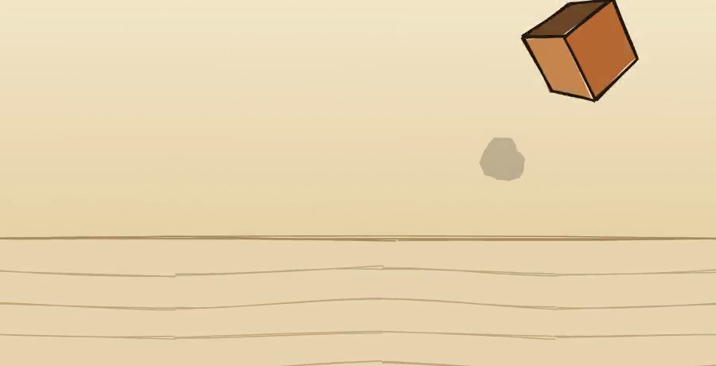](docs/tumble.mp4)

`sketch.box3d(w, h, d, style)` / `sketch.icosahedron3d(radius, style)` / `sketch.mesh3d(vertices, faces, style)` (custom — `[x,y,z]` vertices, faces `{indices, color?}` wound counterclockwise from outside) place a real 3D solid with the usual `moveTo`/`moveBy`. `.spin3d(rx, ry, rz, opts)` is an absolute-target rotation in degrees, chainable like `rotateTo`. Every face is rough.js-sketched and flat-shaded against a key light (`lightDir`, default upper-left); backface culling and painter's-algorithm depth sort run automatically every frame, correct for non-intersecting geometry. A spinning mesh rebuilds its projected silhouette every tick — costlier than a static 2D shape, so reach for it where rotation is actually the point, not as a default upgrade over a 2D shape.

`docs/tumble.mp4` above is one authored scene combining this with the existing 2D vocabulary in the same frame: a `box3d` die tumbles and lands (squash-and-stretch on impact) next to a hand-sketched desk and shadow — proof that 2D and 3D compose, not just that a cube can spin on its own.

## Rigging and walking — IK limbs instead of hand-tuned rotation

```ts
const leg = sketch.limb(150, 100, 40, 40, { color: "#241a12", weight: "bold" }, { bend: 1, capRadius: 10 });
scene.add(leg);
leg.ikTo(190, 130, { at: 0.5, duration: 0.4 }); // foot reaches for a target; the knee solves itself

sketch.walk({
  body: character.group,
  legs: [{ limb: character.legL, hipX: 142 }, { limb: character.legR, hipX: 158 }],
  steps: 8, stepLength: 100, groundY: 446,
});
```

`sketch.limb(rootX, rootY, len1, len2, style, {bend, capRadius, capColor})` is a 2-bone IK chain — a leg or arm whose joint (knee/elbow) angle is solved every frame from an end-effector target, instead of a hand-authored `rotateTo` per segment. `.ikTo(x, y, opts)` moves that target, absolute, in the chain's own local space, and chains like any other animation call. `bend` (`1` or `-1`) picks which of the two valid joint solutions reads correctly for the limb's own orientation — check with a render. Give `len1 + len2` real headroom over the distance it actually needs to reach: a chain at or near full extension gets its target silently clamped onto the reachable radius, which distorts the effective foot position.

`sketch.walk({body, legs: [{limb, hipX}, {limb, hipX}], steps, stepLength, groundY, stepDuration?, liftHeight?, bodyBob?, at?})` generates a whole bipedal gait — foot planting, lift-and-swing, body bob — over exactly two limbs, alternating which leg leads each step, and returns `{endAt}` so you can chain whatever comes after without hand-computing the total duration. `body` moves with `moveBy` (relative), so it composes with wherever the character already is. The planted leg's foot is provably fixed in world space for the whole time it's grounded — not just close at the keyframes — because its `ikTo` for each half-step shares the *exact same* `{at, duration, ease}` as the body's own `moveBy` for that half-step, with the negated delta, so both tweens trace the identical ease curve and cancel at every sampled instant, not just at the endpoints.

```ts
const rig = sketch.quickRig(body, { groundY: 265, stepLength: 42, capRadius: 9 });
const character = sketch.group([rig.legL, rig.legR, body, head]);
```

`sketch.quickRig(body, {groundY, stepLength?, hipDrop?, hipSpread?, reachMargin?, legStyle?, capRadius?})` auto-derives a headroom-safe two-legged rig from `body`'s own bounding box instead of hand-picking hip coordinates and leg lengths — the exact worst-case-reach math from the paragraph above (`sqrt(stepLength² + hipToGroundDrop²)` sized with `reachMargin`, default `1.35`, 35% headroom) computed for you. Returns `{legL, legR, hipY, hipLX, hipRX, len1, len2}` — feed `legL`/`legR` straight into `sketch.walk`'s `legs` array. Named honestly: it derives proportions from a bounding box (center, width, bottom edge), not a real skeleton extracted from an arbitrary drawn silhouette — a much harder problem this doesn't attempt. Good for a round or roughly-humanoid body; an unusual or asymmetric shape may still want hand-placed joints via `sketch.limb`. `examples/gallery/quickrig-walk.ts` is the same character as `walk-cycle.ts` above, with one `quickRig` call replacing five hand-picked constants — verified with the same visual-contact-sheet check across a full stride (no clamp pops) plus a determinism check (same seed always derives the same hip/leg numbers).

## Secondary motion — springs that chase another node

```ts
const bead = sketch.blob(128, 108, 14, style);
scene.add(bead);
bead.springTo(body, { offset: [8, -82], stiffness: 90, damping: 7, at: 1.7 });
```

`node.springTo(driver, {offset?, stiffness?, damping?, at?})` makes `node` chase `driver`'s live position (plus a fixed `[dx, dy]` offset) with damped-spring lag and overshoot, instead of a hand-authored delay — a trailing bead or bobble reacting to what another node does, the layer above rigid IK: a limb's joint angle is *solved*, but nothing about it lags or overshoots on its own. `stiffness` (default `120`) higher reads snappier; `damping` (default `12`) higher means less overshoot (`2*sqrt(stiffness)` is critically damped, no overshoot at all). Runs from `at` (default `0`) through the end of the timeline.

Precomputed once per scene build rather than evaluated live: a damped spring's position at any time depends on its whole history (displacement and velocity both carry forward), not just where its driver is *right now*, so answering an arbitrary seek correctly means either re-integrating from zero on every single seek or computing the whole trajectory once. This does the latter — one dense forward scan of the driver's own resolved position at build time, integrated offline into a lookup table — so a real seek just interpolates between two precomputed samples, and repeated seeks to the same moment come back exact and byte-identical, the same guarantee every other animation in this library has.

A spring only drives the one node's own position — not a whole flexible connector. A plain accessory with no rigid line drawn to its driver — an earring, a bobble on a hat — is what `springTo` alone is for; see `examples/gallery/spring-follow.ts`. For an actual bendy ear or antenna, pair it with `sketch.connector`:

```ts
const antenna = sketch.connector([120, 156], tip, { color: "#2a2a2a", weight: "bold" });
scene.add(antenna);
```

`sketch.connector(anchor, target, style?)` is a stroke that rebuilds itself every seek from the fixed `anchor` point to `target`'s own live resolved position — the same live-position read `camera.follow` and `springTo`'s drivers both use — bowed through one synthetic offset midpoint rather than drawn as a straight segment, so it reads as a flexible rod bending under the tip's own motion instead of a rigid rotating stick. `target` doesn't have to be a `springTo`'d node — a connector tracks any node's live position — but pairing the two is what actually makes an ear or antenna, not just a trailing accessory: see `examples/gallery/bendy-antenna.ts`. No `drawOn` on a connector (there's no stable path length to reveal against geometry that changes every frame) and no line-boil (it already fully rebuilds each seek); `fadeTo`/`moveTo`/etc. on its own transform still work normally. One limitation worth knowing before reaching for this: both `connector` and `springTo` read only a node's own local offset, so a `target`/`driver` whose motion comes entirely from an animated ancestor group (a body placed inside a `sketch.walk` character, say) reads as stationary — give it its own tween if it needs to be tracked or spring-driven.

## Particles — sparks, dust, confetti, a firework burst

```ts
const burst = sketch.particles(200, 220, { color: "#f2c94c" }, {
  count: 40, angle: -90, spread: 100, speedMin: 80, speedMax: 220,
  gravity: 260, lifetime: 1.4, at: 0.3,
});
scene.add(burst);
```

`sketch.particles(x, y, style, opts)` launches `count` (default `24`) small dots from `(x, y)` within a cone (`angle` ± `spread`/2 degrees — screen convention `0` = +x/right, `90` = +y/down, so the default `angle: -90` points straight up) under constant `gravity` (default `220` px/sec², pulling toward +y). `duration` spreads emission across a window instead of firing all at once (default `0`, one burst); `lifetime` (default `1.2`s) is how long each particle stays visible, with `fade` (default `true`) ramping its opacity in then out over that span.

Deliberately not a simulation. Every particle's spawn time, launch angle, speed, and size are drawn once from a seeded PRNG when the emitter is built, so a particle's position at any `t` is a closed-form ballistic formula — `x0 + vx·age, y0 + vy·age + ½·gravity·age²` — a pure function of `t` and that one particle's own fixed numbers, with no history and no dependency on any other node in the scene. That's a real difference from `springTo`: a spring's damped motion genuinely depends on its whole past, which is why it needs a precomputed lookup table at all; particles need nothing precomputed — an arbitrary seek is exact for free, the same way a plain `moveTo` tween already is.

One real gotcha, caught during development, worth knowing about rather than hiding: since a particle's motion is never itself a `tl.to()` call, nothing naturally extends the timeline to cover it — a `--video` export first rendered exactly one frame at t=0 for a scene with nothing else in it, since `tl.duration()` was still 0. Fixed the same way `springTo`'s settle-window is: `sketch.particles` reserves timeline duration through the latest particle's own `spawnTime + lifetime`, computed after everything else already on the timeline is known. See `examples/gallery/particle-burst.ts`.

## Look and texture — two independent axes, the same scene painted differently

```ts
const scene = sketch.scene({ width: 480, height: 420, background: "#7096c6", look: "flat", texture: "grain" });
```

One authored scene — the same geometry, physics, and timing — can render through many different visual treatments, because "what happens" and "how it looks" are separate concerns here. `look` picks the GEOMETRY treatment; `texture` is an OPTIONAL whole-frame post-process layered on top, freely combinable with any of `"ink"`/`"flat"`/`"clay"` — a watercolor wash over ink's own sketchy jitter, or grain over flat's crisp precision, are both real and equally valid. These weren't always two fields: an earlier revision folded watercolor/grain/pixel into `look` itself, forcing them to share flat's crisp geometry — workable until grain (aged paper) needed to pair with ink's own hachure fills for an old-book/engraving register, and crisp-only broke that combination outright. Split into two independent axes instead of guessing at more special-cased look values.

**`look` values:**

- **`"ink"`** (default) — the hand-drawn look everything above assumes: sketchy jitter, line boil, a visible pen tip tracing `drawOn`.
- **`"flat"`** — the identical scene rendered crisp and precise instead: no jitter, no boil, solid fills instead of hachure/cross-hatch, no pen tip. A flat vector motion-graphics look off the same pipeline.
- **`"clay"`** — subtler, hand-molded jitter than ink (pressed, not sketched), solid fills, and — its real distinction — time itself quantized to a ~10fps hold instead of a continuous tween, a genuine stop-motion cadence applied at the seek level. Every downstream system (camera, `drawOn`, IK) needs no special handling for this; it just sees time move in discrete jumps.
- **`"lit3d"`** — a genuinely separate rendering pipeline, WebGL/Three.js instead of SVG/rough.js, with real directional and ambient lighting and cast shadows, driven by the exact same `spin3d`/`moveTo`/`moveBy`/`scaleTo`/`squashTo` calls as every other look. Only `mesh3d` nodes (`box3d`/`icosahedron3d`/custom `mesh3d`) have a 3D representation — every 2D-only node in the same scene (a stroke, a blob, a limb, text) simply doesn't appear in a `"lit3d"` render, and the scene still lints and serializes normally either way. This is lit real-time 3D — one key light, one fill light, soft shadows — not a path tracer; it earns "lit 3D rendering," not "photorealistic." `texture` doesn't reach this pipeline — a separate rendering backend the 2D filter system doesn't apply to.
- **`"toon3d"`** — `"lit3d"`'s exact pipeline, same camera/lights/shadows/`mesh3d`-only scope, with `MeshToonMaterial` and a 4-step gradient map on each mesh instead of a continuous PBR response: flat cel-shaded bands instead of a smooth roughness falloff, plus a black inverted-hull outline (a second back-face-only mesh scaled up ~4% and parented to the real one, so it inherits every animated transform through Three.js's own scene graph instead of a second GSAP tween) — the outline is what actually reads as "toon," the banding alone is subtler. A shading variant of `"lit3d"`, not a third pipeline. Worth being honest about scope: every `mesh3d` face is already flat-shaded (one uniform normal per face, not smoothly interpolated), so the banding shows up as a difference in which of the 4 steps each face's brightness lands on relative to `"lit3d"`'s continuous value — real, and verified with a pixel-diff against the same scene under `"lit3d"` (see the gallery section below), but subtler than cel-shading on smooth geometry would read, since every mesh this library builds is low-poly to begin with.

**`texture` values** (optional, layered over whichever `look` is active):

- **`"watercolor"`** — a whole-frame SVG filter (fractal-noise displacement plus a soft blur) bleeding every edge like wet pigment on paper. A post-process, not a different stroke style underneath.
- **`"grain"`** — a different whole-frame SVG filter: fractal noise converted to a pure-black layer whose alpha (not color) varies with noise brightness, blended over the source via `feBlend "overlay"` — darkens shadows and lightens highlights slightly, the way real grain modulates an image, rather than a flat semi-transparent layer sitting on top of it. Fine aged-paper/film-grain texture instead of watercolor's wet-media bleed, same technique tuned differently. Pairs with `"flat"` for a smooth atmospheric register or with `"ink"`'s own hachure fills for an old-book/engraving one — genuinely different results from the same filter, because geometry and texture are independent.
- **`"pixel"`** — a raster post-process applied to every captured frame after the browser screenshot instead: downsample to a low-resolution grid, then scale back up with nearest-neighbor (no smoothing), so every cell lands as one flat-colored block. This happens outside the DOM entirely (in the CLI, on the captured PNG bytes, via `ffmpeg`), not as an SVG filter like watercolor/grain — the only texture that needs `ffmpeg` on `PATH` outside of `--video`. Two consequences of living in the CLI's capture step, operating on the final composited frame, rather than the renderer: it stays scene-only (a `Film` entry using `texture: "pixel"` renders at full resolution, uncropped by this post-process — there's no way to selectively pixelate one entry's screen region after everything's already composited into one canvas, unlike watercolor/grain, which are SVG filters scoped to each entry's own content and DO apply correctly inside a `Film`), and `--serve` won't show it either, since that mode skips the CLI's capture step entirely and opens the raw page in a browser.

[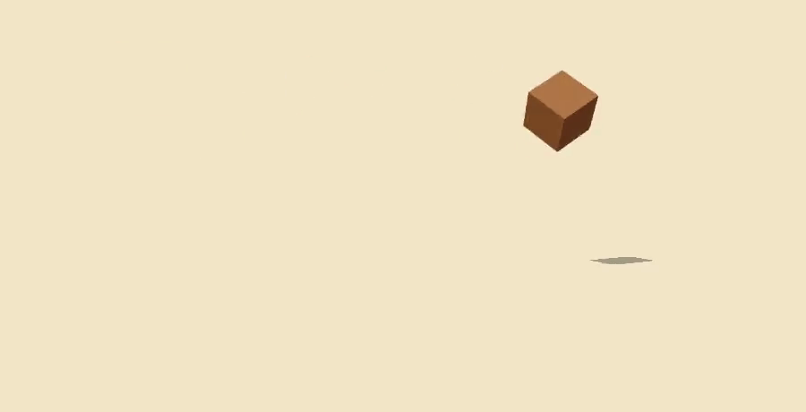](docs/tumble-lit3d.mp4)

That's the same authored file as `docs/tumble.mp4` above with one line changed (`scene.look = "lit3d"`) — the die keeps its exact tumble and timing, and everything else about how it's painted changes. Nothing about how you *author* a scene depends on `look`/`texture` — every primitive, animation, and everything documented above applies the same regardless. Both are rendering decisions, not authoring ones.

## Self-verification, without burning tokens

Rendering a full screenshot after every edit is slow and expensive. sketchling checks in three tiers, cheapest first:

- **Tier 0 (free, every render).** A deterministic structural linter — off-canvas elements, degenerate paths, heavy overlaps, off-center composition — runs in plain code, zero LLM tokens, before any pixel exists. Nested detail (eyes on a face, a keyhole on a laptop screen) routinely trips the overlap warning — that's expected noise for intentional nesting, not a sign something's wrong; it's there to catch two *unrelated* shapes stacked by mistake.
- **Tier 1 (cheap).** `--crop` renders just the content's bounding box instead of the full canvas, for a cheap visual check while iterating.
- **Tier 2 (occasional).** A full-resolution render, for a final look.

```
sketchling render scene.ts --out preview.png            # full render, settled end state
sketchling render scene.ts --out preview.png --at 0.6    # a specific point in the timeline
sketchling render scene.ts --crop --out thumb.png        # cropped to content
sketchling render scene.ts --video out.mp4 --fps 24      # the whole timeline, as an MP4
sketchling render scene.ts --serve                       # open it live in a real browser
```

`--video` runs about a second longer than the scene's own timeline — it holds on the settled end frame instead of cutting on the exact last drawn frame.

## How it works

A scene graph (`Scene` → `Stroke`/`Blob`/`Group`, styled and timed) is built by running your `scene.ts` in Node — the core library has no DOM dependency, so this is cheap and lets the Tier 0 linter run before any rendering happens. The serialized scene is then handed to a headless Chromium page, where [rough.js](https://roughjs.com) draws it as SVG and [GSAP](https://gsap.com) drives the timeline.

`drawOn` does **not** dash-reveal rough.js's own output path — rough.js authors its `d` as several short overlapping passes for sketchy texture, not one sequential sweep, so a direct dash-reveal doesn't trace in visual order (a rectangle can render fully closed a fifth of the way through its draw). Instead, each shape is revealed through an SVG mask built from the *clean* geometric path: a stroked copy of it drives the dash-reveal (the pen trace), and for closed shapes a clipped zigzag scribble dash-reveals the interior row by row once the trace is mostly through (like a hand coloring it in, not a flat block fading in) — together they reveal the real rendered artwork, hachure fills included, in the order a hand would actually draw it. A small dot rides the trace's leading edge as the pen tip. The pace itself uses GSAP's `RoughEase` rather than linear or classically-eased timing, so the draw hesitates and quickens unevenly instead of moving at a constant or smoothly-accelerating rate — both of which read as mechanical.

**Line boil.** A hand never traces the exact same wobble twice — a line that stops moving the instant it lands reads as dead, no matter how well it got there. Every stroke is actually rendered two or three times, each with a different rough.js seed, stacked in the same spot; visibility cycles between them a few times a second for as long as the shape is on screen, drawn or not. It's a small, continuous re-jitter — never a jump — running for the life of the scene, including during the end-of-video hold.

**Pacing.** One pen draws at a time: examples schedule each shape's `drawOn` window after the previous one finishes, with a short gap standing in for a pen lift, rather than starting several shapes at once. A scene *can* run shapes concurrently (nothing enforces single-pen scheduling), but two things drawing themselves simultaneously reads as two hands, not one — schedule sequentially, with gaps, unless you deliberately want that effect.

## Status and roadmap

Early and opinionated by design: v1 targets one aesthetic (flat, hand-drawn line illustration, the Notion/Anthropic register) rather than being a general illustration engine. The bet is that a small, well-designed vocabulary in one register beats a sprawling API that does everything adequately. Broader styles come once this one is genuinely good.

If you're using [Claude Code](https://claude.com/claude-code) inside this repo, `.claude/skills/sketchling/` is available and teaches the vocabulary directly — no README round-trip needed.

Not yet built: more shape helpers beyond `arrow`/`speechBubble` (a star, a checkmark) as thin geometric compositions of the existing primitives, not a curated asset library — that's a deliberate non-goal, see "Why" above; a genuine skeleton extracted from an arbitrary drawn silhouette (`quickRig` derives proportions from a bounding box, which covers the common case — true silhouette analysis is a harder, separate problem); an inverted-hull outline pass extended to non-toon looks.

## Contributing

Issues and PRs welcome. If you build a scene that stress-tests the vocabulary in a new direction — a style `drawOn` doesn't handle well, a composition the Tier 0 linter gets wrong — that's exactly the kind of thing worth opening an issue for, ideally with the scene file attached.

## License

MIT — see [LICENSE](LICENSE).
